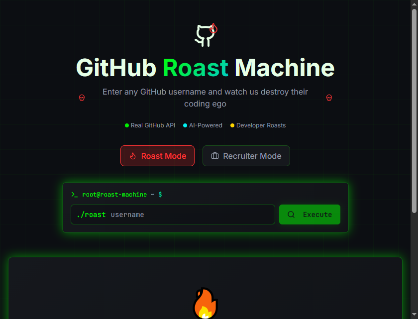
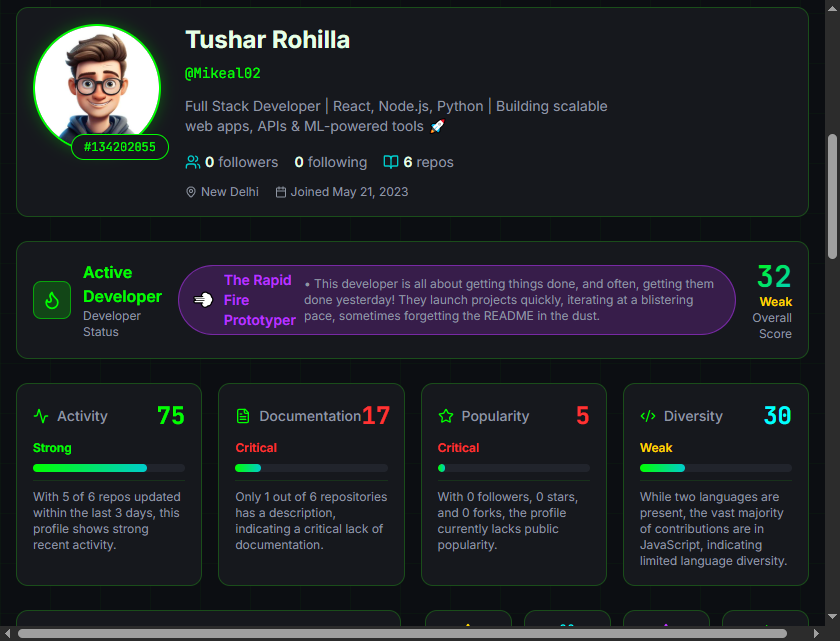
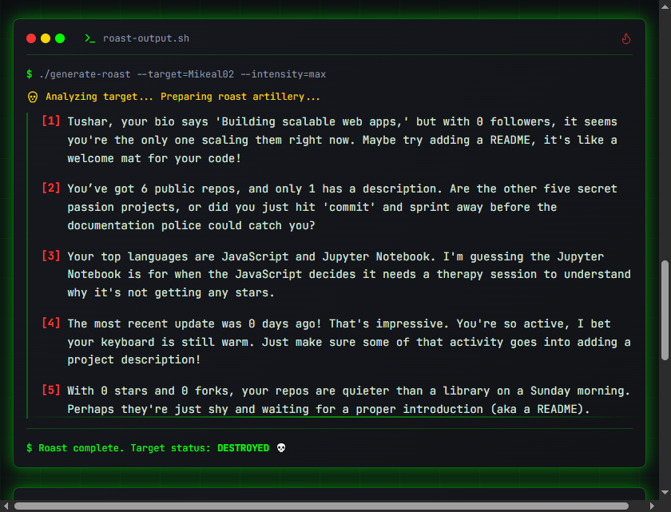
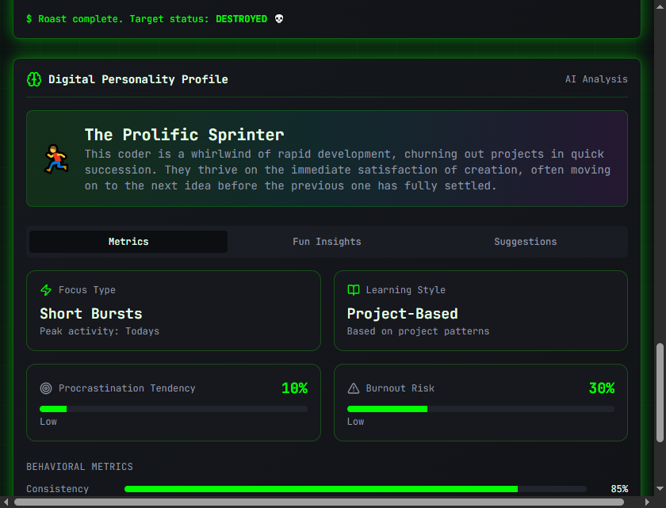

# Roast My Git

**Roast My Git** is a fun, AI-powered tool that analyzes your GitHub profile and delivers a brutal (but hilarious) roast of your coding habits, commit messages, and repository chaos.  
Put your ego aside and see what your code really says about you.

**Live Demo:** [https://roastmygit.netlify.app/](https://roastmygit.netlify.app/)

---

## 📌 Overview

Roast My Git scans public GitHub profiles and provides:

- Insightful analysis of repositories, commits, and languages.
- Personalized, AI-generated roasts based on actual coding behavior.
- Identification of developer stereotypes like “Spaghetti Code Chef” or “README Neglecter.”

It’s built to be fast, responsive, and fun while offering a peek into your coding personality.

---

## 🖼️ Screenshots

**Landing Page** 

  
*Main landing page of the application.*

**GitHub Profile Search Page**:*Enter any GitHub username to analyze.*


 
 


**Roast Page**:*Displays the AI-generated roast.*


  


**Digital Personality Page**:*Shows a fun personality breakdown based on coding habits.*
 

  


---

## ✨ Features

- **Deep Profile Analysis:** Scans repositories, commit history, and language usage.  
- **AI-Powered Roasts:** Generates witty, personalized roasts using LLMs.  
- **Developer Stereotypes:** Identifies patterns like “Spaghetti Code Chef” or “Copy-Paste Stack Overflow Engineer.”  
- **Fast & Responsive UI:** Clean, modern interface built for speed and clarity.  

---

## 🛠 Tech Stack

| Layer | Technology |
|-------|------------|
| Frontend | React.js, TypeScript, HTML5, CSS3 |
| API | GitHub REST API |
| AI Engine | Gemini API |
| Deployment | Netlify |

---

## 🚀 Getting Started

### Prerequisites
- Node.js v16 or higher  
- npm or yarn  
- API Key for AI service (Gemini or OpenAI)

### Installation
1. Clone the repository:
```bash
git clone https://github.com/yourusername/github-roast-master.git
cd github-roast-master
```

2. Install dependencies:
```bash
npm install
# or
yarn install
```

3. Set up environment variables:
Create a .env file in the root directory:
```bash
REACT_APP_GITHUB_TOKEN=your_github_token_here
REACT_APP_AI_API_KEY=your_ai_api_key_here
```

4. Run the application:
```bash
npm start
```

## 🎮 Usage

1.Enter a valid GitHub username in the search bar.

2.Click “Roast Me”.

3.Wait for the AI to analyze the profile.

4.Read your roast and share it with friends!
---


## 🤝 Contributing

Contributions are welcome!

1.Fork the repository

2.Create your feature branch:
```bash
git checkout -b feature/AmazingFeature
```

3.Commit your changes:
```bash
git commit -m "Add some AmazingFeature"
```

4.Push to the branch:
```bash
git push origin feature/AmazingFeature
```

5. Open a Pull Request
---

## 📄 License

MIT License — see LICENSE for details.
