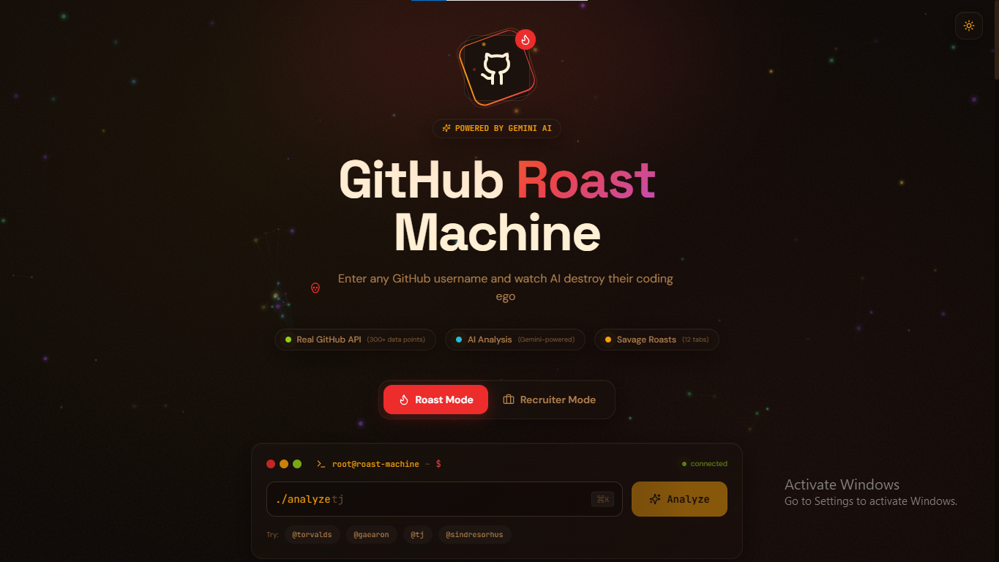
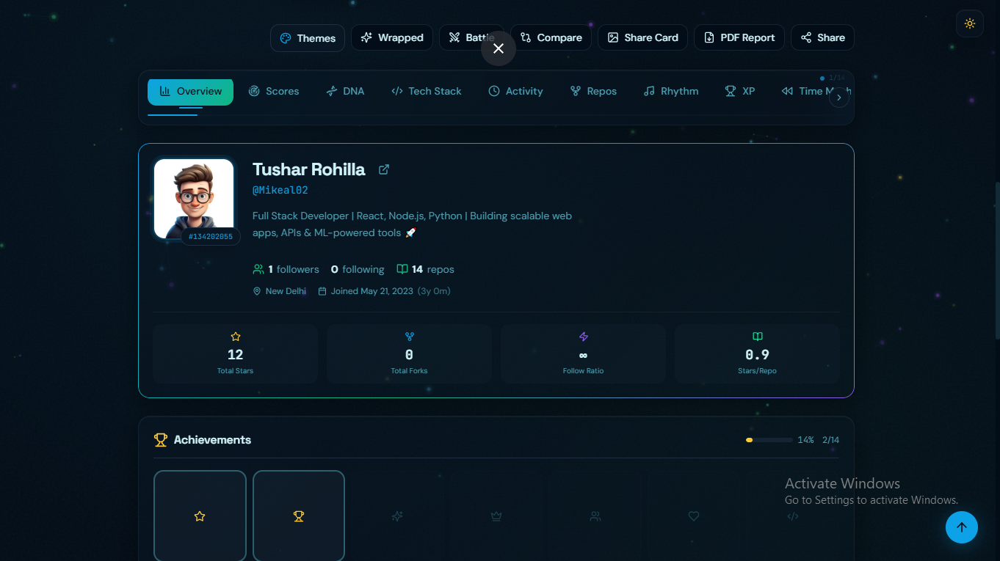
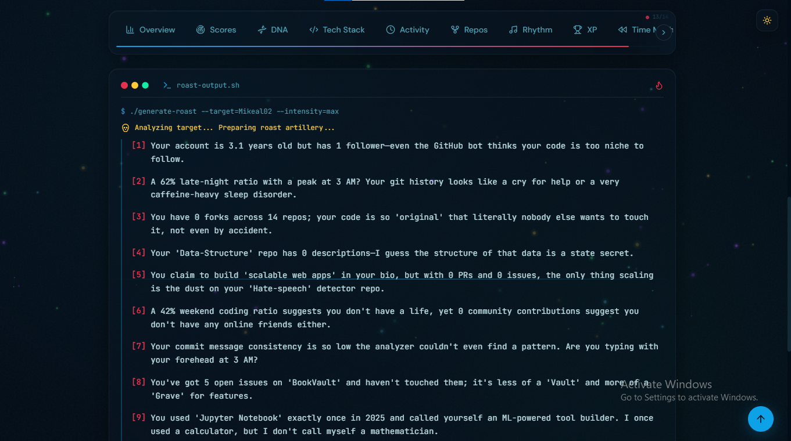
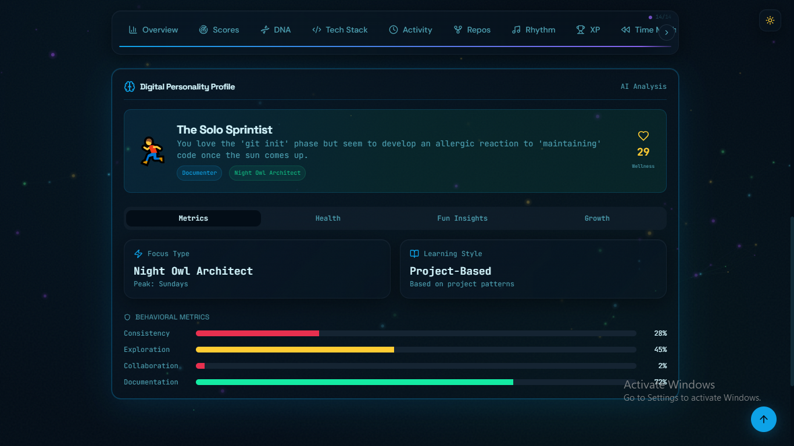

<h1 align="center">
  
  <br/>
  🔥 Roast My Git
</h1>

<p align="center">
  <strong>The AI That Reads Your GitHub Profile So You Don't Have To.</strong>
</p>

<p align="center">
  Analyze • Judge • Roast • Repeat
</p>

<p align="center">
  <a href="https://roastmygit.netlify.app/">
    
  </a>
  
  
  
  
</p>

---

<p align="center">
  
</p>

> **Every GitHub profile tells a story.**
>
> Some tell stories of clean architecture, discipline, and engineering excellence.
>
> Others tell stories of panic commits, abandoned side projects, mysterious repositories, and README files that haven't seen daylight since creation.
>
> **Roast My Git finds those stories and roasts you for them.**

---

# 🔥 What Is Roast My Git?

**Roast My Git** is an AI-powered GitHub profile analyzer that transforms repository data into brutally honest (and hilarious) developer roasts.

Simply enter a GitHub username.

The app analyzes:

- Repositories
- Programming Languages
- Commit Patterns
- Project Activity
- Profile Structure
- Repository Quality

Then an AI model creates a unique roast based on actual developer behavior.

---

# 🎭 Meet Your AI Judge

### The Process

```text
GitHub Username
       ↓
GitHub API Analysis
       ↓
Repository Intelligence
       ↓
AI Personality Engine
       ↓
Brutal Roast Generated
       ↓
Ego Damage Delivered
```

---

# ✨ Features

## 🔍 Deep GitHub Analysis

The AI doesn't guess.

It inspects real profile data including:

- Public repositories
- Languages used
- Repository naming habits
- Commit behavior
- Project diversity
- Profile completeness

---

## 🤖 AI-Powered Roasts

Every roast is generated dynamically.

No templates.

No copy-paste responses.

No mercy.

Examples:

> "You have 47 repositories and 43 of them are unfinished. Even your TODO lists have TODO lists."

> "Your commit history looks like a heartbeat monitor during a coding interview."

> "Your README files contain less information than a fortune cookie."

---

## 🧠 Digital Developer Personality

Beyond roasting, the AI builds a coding personality profile.

Possible archetypes include:

- 🍝 Spaghetti Code Chef
- 🏗️ Framework Collector
- 💤 Weekend Commit Warrior
- 🔥 Hackathon Survivor
- 📦 Tutorial Completionist
- 🎯 README Perfectionist
- 🤡 Copy-Paste Stack Overflow Engineer

---

## ⚡ Lightning Fast

- Instant profile lookup
- Fast GitHub API processing
- Optimized AI generation
- Responsive UI

---

## 📱 Fully Responsive

Designed for:

- Desktop
- Tablet
- Mobile

Because everyone deserves to be roasted equally.

---

# 🎥 Product Showcase

## 🏠 Landing Page



---

## 🔍 GitHub Profile Search



---

## 🔥 Roast Results



---

## 🎭 Digital Personality Report



---

# 🚀 Why This Project Exists

Most GitHub analysis tools focus on productivity.

Roast My Git focuses on entertainment.

The goal is simple:

Turn GitHub profiles into comedy.

At the same time, the project demonstrates:

- API Integration
- Prompt Engineering
- AI Content Generation
- Data Analysis
- Frontend Development
- User Experience Design

---

# 🛠️ Tech Stack

## Frontend

- React
- TypeScript
- Vite
- Tailwind CSS

## APIs

- GitHub REST API

## AI Engine

- Gemini API

## Deployment

- Netlify

---

# 🏗️ Architecture

```text
User Input
     ↓
GitHub Username
     ↓
GitHub API
     ↓
Repository Analysis
     ↓
AI Prompt Generation
     ↓
Gemini AI
     ↓
Roast + Personality Report
     ↓
Beautiful UI Output
```

---

# ⚙️ Getting Started

## Clone Repository

```bash
git clone https://github.com/<yourusername>/github-roast-master.git

cd github-roast-master
```

---

## Install Dependencies

```bash
npm install
```

---

## Environment Variables

Create a `.env` file:

```env
REACT_APP_GITHUB_TOKEN=your_github_token_here

REACT_APP_AI_API_KEY=your_ai_api_key_here
```

---

## Start Development Server

```bash
npm run dev
```

---

Application runs on:

```bash
http://localhost:5173
```

---

# 🎮 How To Use

### Step 1

Enter a GitHub username.

### Step 2

Click:

```text
🔥 Analyze
```

### Step 3

Wait a few seconds while the AI investigates the profile.

### Step 4

Receive emotional damage.

### Step 5

Share results with friends.

---

# 🌐 Live Demo

### Try It Now

https://roastmygit.netlify.app/

---

# 🔮 Future Roadmap

## Roasting

- [x] Multi-Level Roast Modes
- [x] Savage Mode
- [x] Corporate Recruiter Mode
- [ ] Senior Engineer Mode

## Analytics

- [x] Repository Health Score
- [x] Developer Evolution Timeline
- [x] GitHub Achievement System

## Social

- [x] Shareable Roast Cards
- [x] Roast Battles
- [ ] Leaderboards

---

# 🤝 Contributing

Want to make the internet meaner?

Contributions are welcome.

```bash
git checkout -b feature/amazing-feature

git commit -m "Add amazing feature"

git push origin feature/amazing-feature
```

Open a Pull Request.

---

# 📄 License

Licensed under the MIT License.

---

<p align="center">

## 🔥 Roast My Git

**Because Every Developer Deserves Constructive Criticism...**

**...and a Little Emotional Damage.**

</p>
````
